# spring-boot activiti通用框架
> 本项目主要搭建一个基于spring-boot的通用微服务框架，集成了包括spring,mybatis,freemarker,
thymeleaf,redis+ehCache两级缓存,kafka,邮件服务以及spring-activiti流程引擎等服务。

# 系统架构

# 一、 用户认证与权限

把activiti认证与权限转交给open ldap（待实现）

# 二、互评流程设计

## 1. 流程图

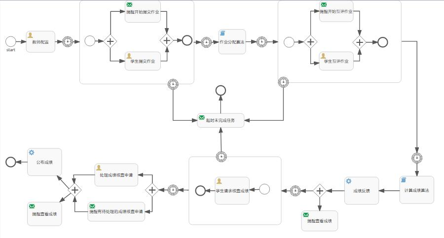

## 2.流程图解析
### （1）教师配置阶段

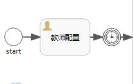

“教师配置”需要进行的操作为：

设置各个阶段的起止时间

|阶段名|	开始时间|	结束时间|
|:--:|:--:|:--:|
|学生提交作业阶段	|2017.8.7T00:00	|2017.8.14T23:59|
|学生互评阶段	|2017.8.15T00:00	|2017.8.22T23:59|
|成绩核查阶段	|2017.8.24T00:00	|2017.8.30T23:59|

教师完成配置之后，等待一段时间直到达到配置好的“学生提交作业阶段”的开始时间（2017.8.7T00:00）才会启动子流程，进入到“学生提交作业阶段”
### （2）学生提交作业阶段

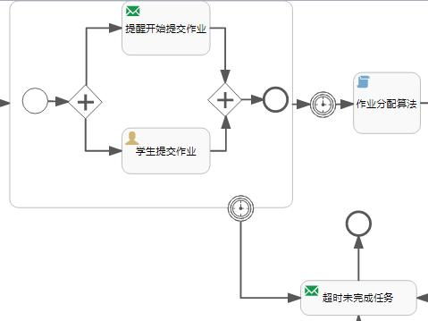

这是一个子流程。

流程开启时会：
+ 发邮件通知学生己经可以开始提交作业，
+ 同时学生可以执行提交作业的活动。

这里有一个超时边界条件，如果超过了“学生提交作业阶段”设置的结束时间，该学生还没有完成提交作业的任务，则会“发送超时未完成任务”的邮件，然后结束流程，该学生不能进行后续的所有阶段。
### （3）作业分配阶段

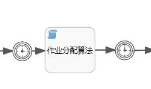

当“学生提交作业”之后，会等待，直到到达“学生提交作业阶段”的结束时间（2017.8.14T23:59），才会执行“作业分配算法”，对所有己提交作业进行分配。分配结束之后仍会等待，直到到达“学生互评阶段”的开始时间（2017.8.15T00:00），才会进入下一阶段（“学生互评阶段”）。

### （4）学生互评阶段

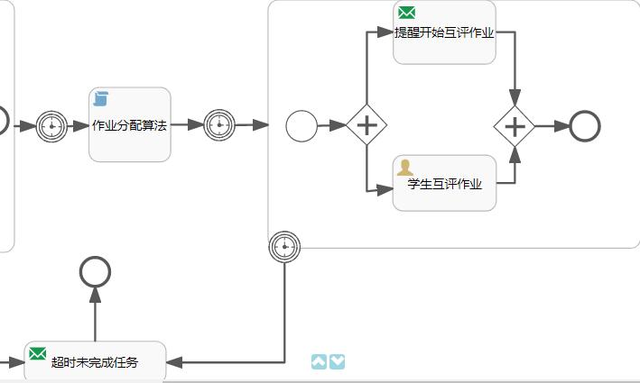

当到达“学生互评阶段”的开始时间（2017.8.15T00:00），会进入到“学生互评阶段”子流程。流程开启时会：
+ 发邮件通知学生己经可以开始提交作业，
+ 同时学生可以执行互评作业的活动。

这里有一个超时边界条件，如果超过了“学生互评阶段”设置的结束时间（2017.8.22T23:59），该学生还没有完成提交作业的任务，则会“发送超时未完成任务”的邮件，然后结束流程，该学生不能进行后续的所有阶段。

### （5）计算成绩及公布成绩阶段

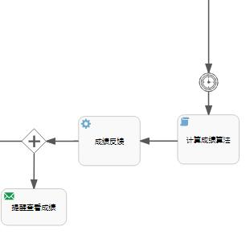

当“学生互评阶段”完成后（2017.8.22T23:59），会自动执行“计算成绩算法”脚本，然后把计算好的成绩通过“成绩反馈”发布给学生，并给学生发邮件“提醒查看成绩”。

### （6）成绩核查申请阶段

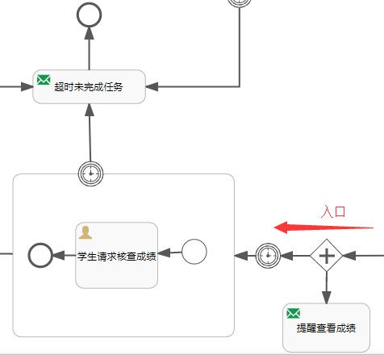

当时间到达“成绩核查阶段”的开始时间（2017.8.24T00:00），会进入到“成绩核查阶段”子流程。在这个子流程中：

《学生执行“请求核查分数”的任务》

如果“成绩核查阶段”的结束时间（2017.8.30T23:59）到达，但学生没有提交请求核查分数的申请，说明学生不需要进行核查，结束流程。

### （7）成绩核查阶段

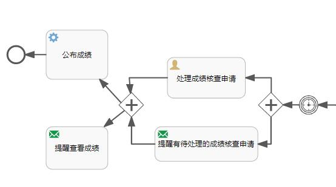

当到达“成绩核查阶段”的结束时间（2017.8.30T23:59）之后，进入到“成绩核查阶段”

+ 发邮件给教师，提醒有成绩核查的请求等待处理
+ 教师执行核查分数的操作（可以手动修改学生的成绩）

核查结束，再次公布成绩，并通知参与核查的学生查看成绩。

# 三、界面截图

## (1)管理员

登陆界面

管理员界面
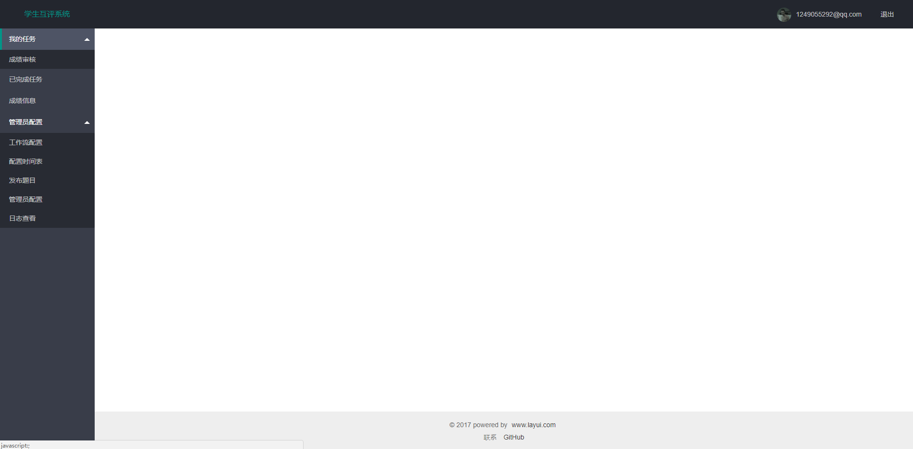

工作流配置

管理员基本配置
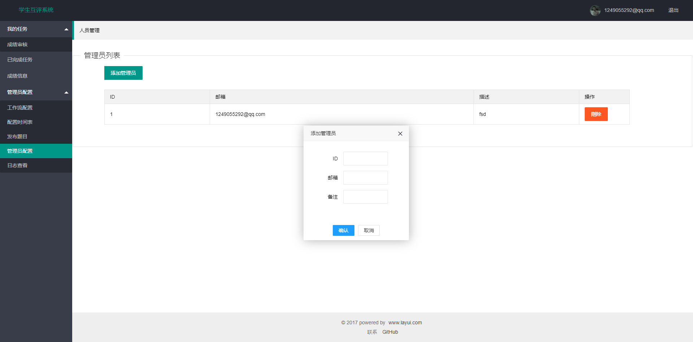

发布题目
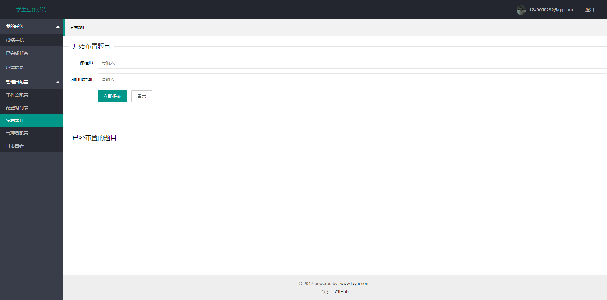

## (1)普通用户

普通用户界面

答题

互评
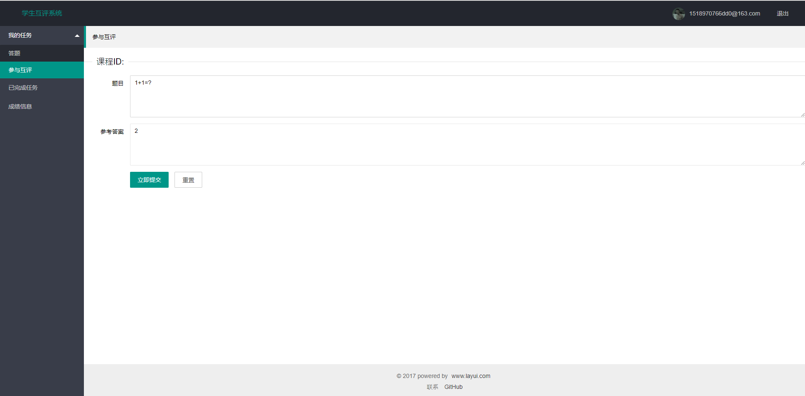

# 四、邮件服务

每阶段截止日期前系统会自动发邮件提醒用户。（接口己实现）

# 五、性能优化

+ redis二级缓存。
+ kafka异步邮件发送。

# 六、接口

[接口说明](./doc/接口说明.md)
