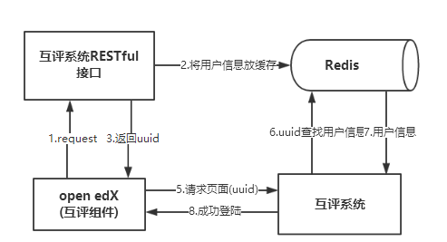
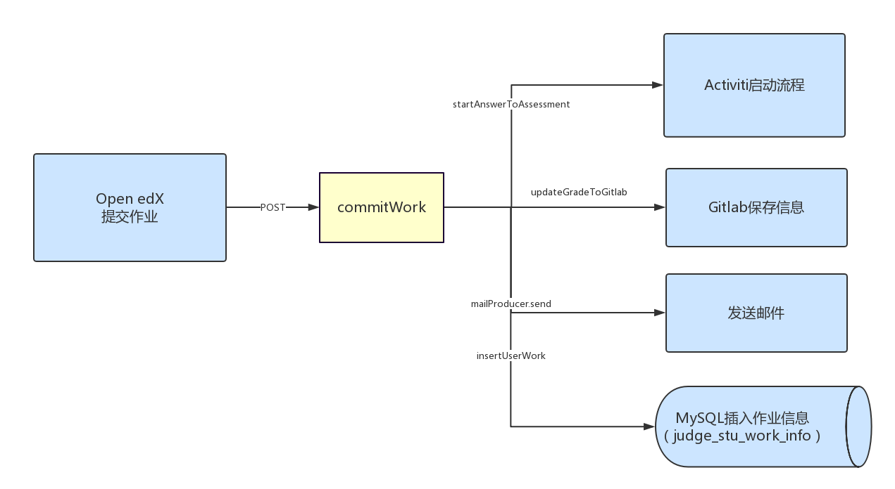
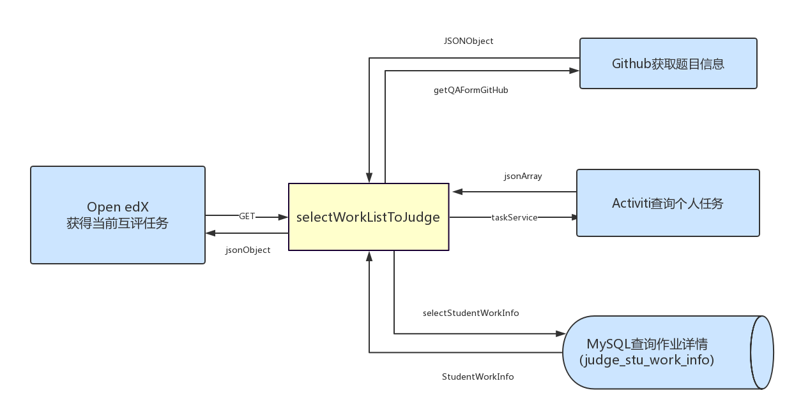
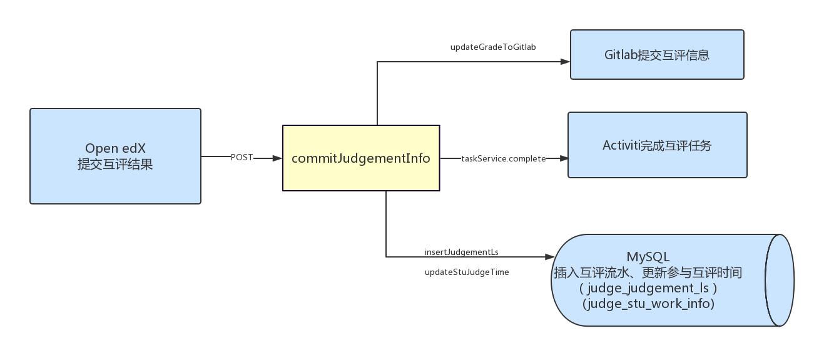
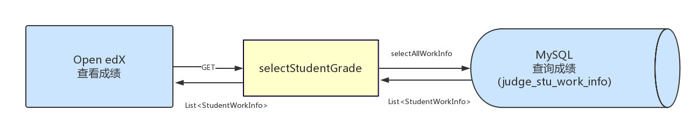
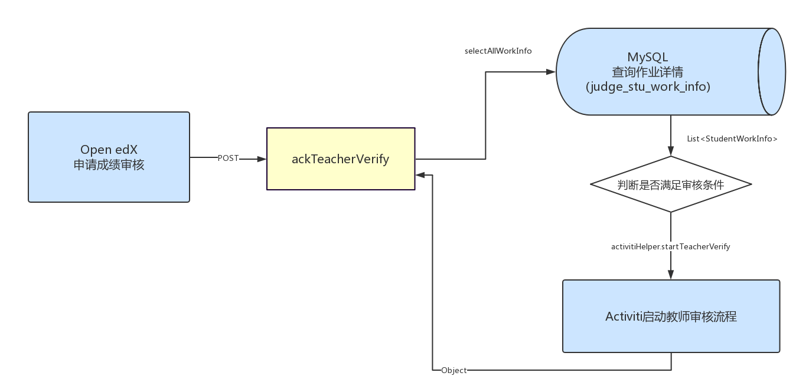
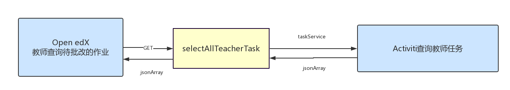
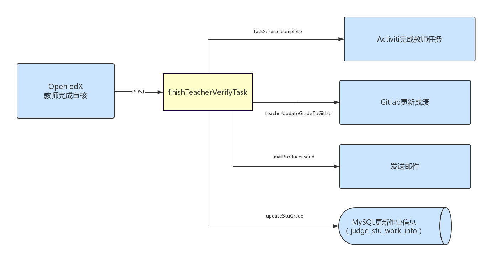

## Open edX与Activiti的部分接口说明

### 1. 登陆对接

用户登录Open edX平台之后，证明该用户己是合法用户。Activiti和Open edX之间需要进行登录对接，以确定不同用户的流程状态。
```
POST  /api/common/loginAbutment  
```
该接口包含email、userName、userType和signature四个参数。

+ email: 是当前Open edX平台登录用户的邮箱
+ UserName: 是当前Open edX平台登录用户的用户名
+ userType: 是用户类型，包括学生(student)和教师(staff)两种,通过userType可以判断用户是教师用户还是学生用户，不同用户类型返回的信息不同；
+ signature: 是标志信息，由用户基本信息和私有令牌按一定的规则拼接，再用SHA256算法进行签名生成; 

                 `signature=SHA256(email||userName||userType||private\_token)`




互评系统在接收到Open edX的互评组件的POST请求之后，互评系统把接收到的email、userName和userType参数的值与互评系统自身private\_token进行拼接，也进行SHA256操作，校验signature。如果signature相同则证明该HTTP请求是来自Open edX的合法请求，互评系统随机生成一个唯一的uuid作为HTTP响应，同时以uuid为key将用户信息放到redis中，并设置uuid的过期时间为3s。由于整个对接过程基本在一瞬间就能完成，因此这里过期时间设置的短一点可以防止非法用户通过抓包拿到数据后进行重放攻击。

Open edX收到来自互评系统的HTPP响应之后，携带uuid向互评系统请求页面，互评系统根据uuid从Redis查找用户信息，然后将所有信息存入到session中，返回相应的页面，登录对接完成。由于己经维护了session，Open edX的互评组件通过发起HTTP请求（POST、GET、DELETE、PUT）可以直接与互评系统进行交互。

### 2. 提交作业

用户在Open edX平台完成练习题，当提交练习题时，如果该练习题需要进行同伴互评，则会调用Activiti提供的commitWork接口，启动互评流程，同时把用户的答案提交到Gitlab保存。

```POST  /api/user/commitWork ```

参数：CourseCode:题号； workDetail: 作业详情； email：用户邮箱

返回：提交是否成功；



启动流程的Activiti接口为：runtimeService.startProcessInstanceByKey。 同时会把作业信息提交到Gitlab。

### 3. 查询互评任务

查询当前用户是否有需要进行互评的任务，如果有，则返回互评任务列表

```GET /api/user/selectWorkListToJudge ```

参数：courseCode：题号 email： 邮箱

返回：json对象（互评任务列表）



### 4. 提交互评结果

```POST  /api/user/commitJudgementInfo ```


参数：judge：评阅内容； courseCode：题号；email ：邮箱

返回：提交是否成功。



调用该接口时首先检查是否参与过互评，然后对互评结果进行封装并提交到Gitlab，插入互评流水，更新该用户参与互评的时间，调用Activiti的taskService.complete(taskId)接口完成该用户的互评任务。

### 5. 查看成绩

```GET /api/user/selectStudentGrade ```

参数：email

返回：成绩列表



```

    <select id="selectAllWorkInfo" parameterType="string" resultType="com.activiti.pojo.user.StudentWorkInfo">
        SELECT *
        FROM judge_stu_work_info
        WHERE EMAIL_ADDRESS = #{email};
    </select>
```

### 6. 申请让老师审核成绩

```POST  /api/user/ackTeacherVerify ```

参数：courseCode:题号; email:邮箱

返回：是否允许成绩审核



首先判断该作业是否是允许进行成绩申诉的流程，其次判断是否己被老师批改过作业、该用户是否参加过互评（没有参加互评则不能申请成绩审核）、是否己经申请过成绩审核。

经过上述判断后，只有满足成绩审核条件，才启动教师审查流程。runtimeService.startProcessInstanceByKey("verifyTask", businessKey, variables);

### 7. 教师查询需要批改的作业

```GET /api/user/selectAllTeacherTask ```

参数：email

返回：待批改作业列表



首先根据email判断是否是教师，如果是教师才可以调用查询接口。

```
    List<Task> list = taskService
                .createTaskQuery()//
                .taskAssignee("teacher")//个人任务的查询
                .list();
```
遍历list，根据taskId获得学生作业信息，把结果放入jsonArray

### 8. 教师完成成绩批改

```POST  /api/user/finishTeacherVerifyTask ```

参数：taskId：任务Id; courseCode:题号； emailAddress:邮件；grade：成绩

返回：批改是否成功



调用Activiti的完成任务接口taskService.complete(taskId)完成教师的任务。根据参数获得学生作业信息，更新其在Gitlab中的成绩。

## 接口列表

|方法 |接口 |说明 |
| :-------------: |:-------------:| :-----:|
|GET |/api/common/getQAContent |Github请求题目和答案 |
|GET |/api/common/selectScheduleTime |查询指定题目的流程配置|
|GET |/api/common/selectAllScheduleTime  |查询所有题目的流程配置|
|GET |/api/common/selectInvokeLog  |查询接口调用日志|
|GET |/api/common/selectEmailLog |邮件日志查询|
|GET |/api/user/selectStudentWorkInfo  |查询学生已经提交的作业|
|GET |/api/user/selectWorkListToJudge  |查询需要评论的任务|
|GET |/api/user/selectStudentGrade |学生成绩查询|
|GET |/api/user/selectWhoJudgeMe |查询哪些人评论了我的作业|
|GET |/api/user/selectAllTeacherTask |查询教师需要完成的任务|
|POST | /api/common/loginAbutment  |登陆对接|
|POST | /api/user/commitWork |学生提交作业|
|POST | /api/user/commitJudgementInfo  |提交互评结果|
|POST | /api/user/ackTeacherVerify |申请让老师批改作业|
|POST | /api/user/finishTeacherVerifyTask  |教师完成任务并提交|
