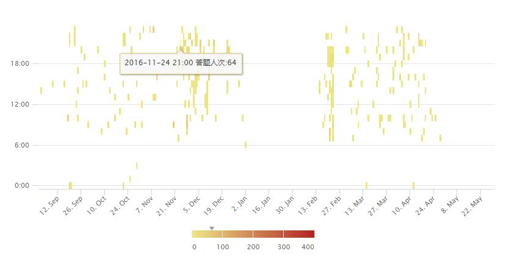

## 课程整体练习情况

整个课程所有学生各章节得分归一化之后，画出极坐标图。图中极坐标原点表示归一化成绩为0, 最外圈表示归一化成绩为1。

## 学生练习成绩分布

学生每章节的得分归一化之后得到极坐标图。图中极坐标原点表示归一化成绩为0, 最外圈表示归一化成绩为1。黑色线段表示的是指定学生的成绩分布，蓝色表示的是这门课程的总体成绩分布 。
从图中可以看到该同学练习成绩总体上高于班级平均水平。

## 练习回答频率分布

对课程练习题各个时间段的提交次数做统计，得到练习题回答频率分布热力图。

从每一天的回答频率分布来看：从图中可以看出学生提交练习的时间段在下午18点附近比较集中，凌晨12点至上午12点这段时间提交频率较低。由此可以分析学生在线学习的学习习惯。

从每个学期的回答频率分布来看：如（9月12-1月2日），在接近学期末的时候学生提交频率较高（如11月21日到12月5日）。

