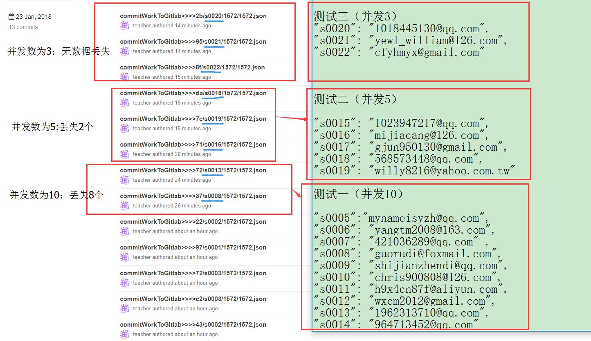
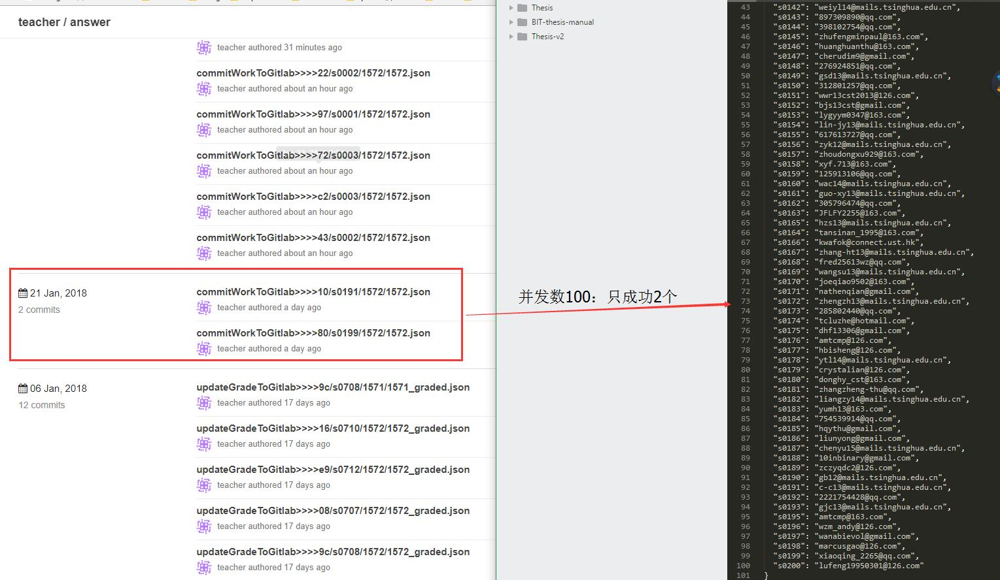

## 带用户信息的压力测试

### 测试场景

用户提交作业时，会触发后台的如下操作：

+ Activiti：启动activiti流程
+ Gitlab：把作业详情提交到gitlab
+ 邮件服务：给用户发送邮件提醒
+ Mysql：插入作业信息

### 测试代码

使用nodejs脚本测试。代码: [点击查看](../code/pressTest/commitTest)

测试用例：提交题号为1571，用户为[account.json](../code/pressTest/commitTest/account.json)，并发提交（async.eachLimit方法）。

### 测试结果
+ Activiti：启动流程成功（通过查看act_hi_procinst表，多个测试情况下流程启动正常）
+ 邮件服务：使用了kafka，经测试能保证邮件成功发送，无数据丢失。
+ Mysql：插入作业信息成功（通过查看judge_stu_work_info表，多个测试情况下插入作业信息都成功）
+ Gitlab: 把作业提交到gitlab，没有使用kafka，测试时当并发用户数大于3时，gitlab会出现数据丢失。

| 并发数        | Gitlab提交 |
|:-------------:|:-------------:|
| 3      |无丢失|
| 4     |有丢失（提交成功2个）|
| 5     |有丢失（提交成功3个）|
| 10     |有丢失（提交成功2个）|
| 100     |有丢失（提交成功2个） |

